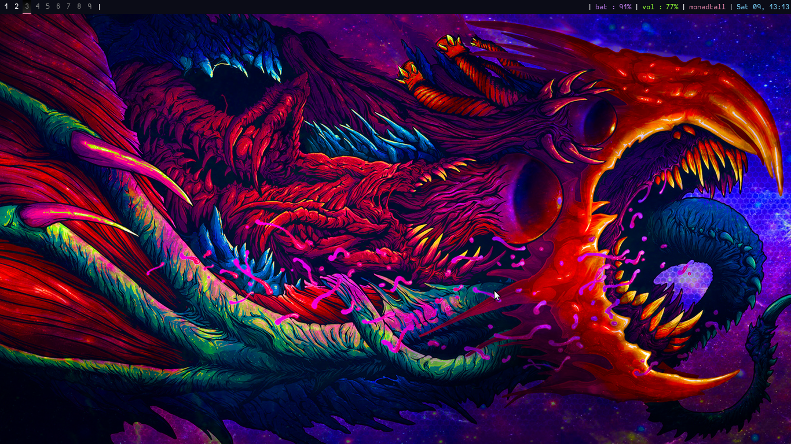

## QTILE Config Files

I've played around with Qtile for a while, and I must say, it's a pretty well designed tiling window manager. The configuration file is written in Python, which makes configuring the window manager very easy once you understand the basics of Python.

I don't really use Qtile anymore, but I will reference the documentation [here](http://docs.qtile.org/en/stable/) for your reference. Just copy the autostart and config file into the proper directory listed in the documentation.
